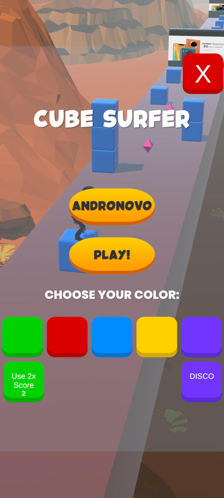
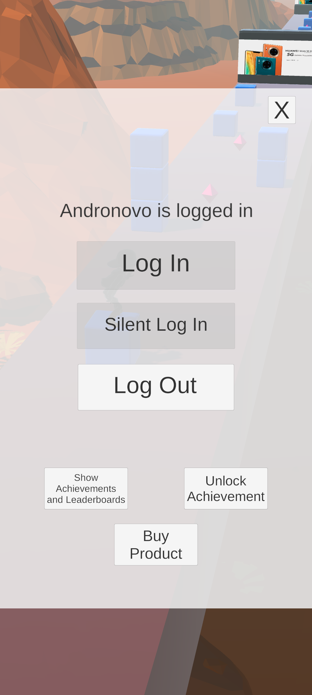
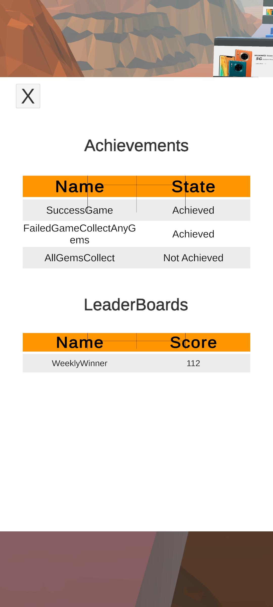
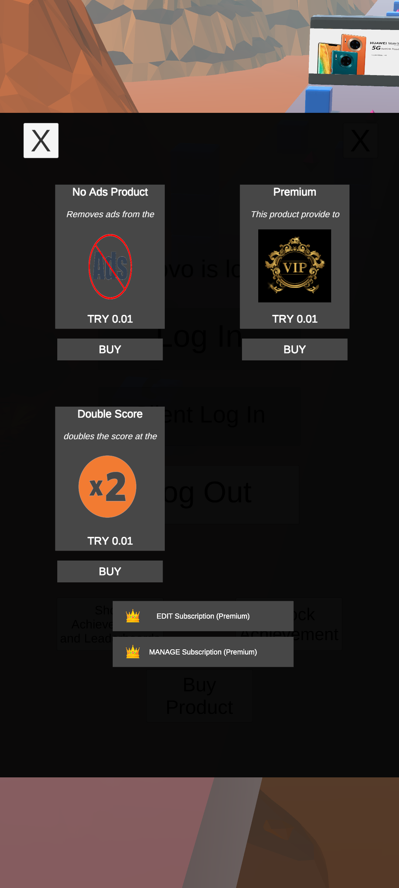
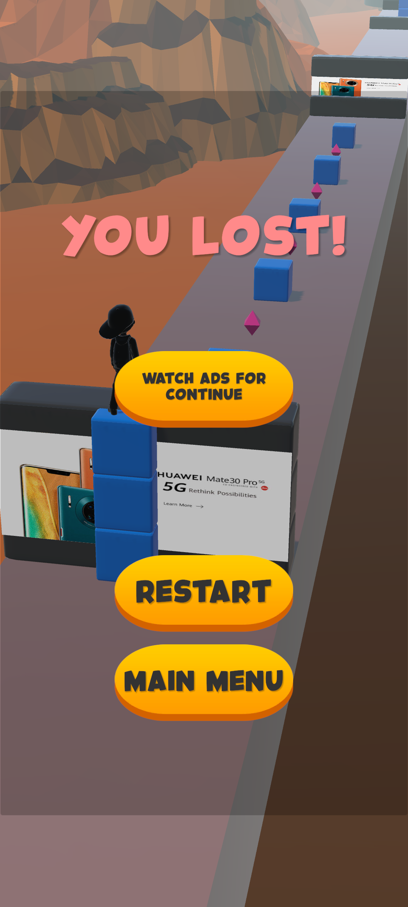
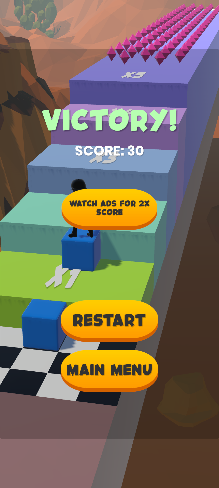

# Reference Game with Huawei Mobile Services (Cube Surfer)

A fun gameplay, cube surfer is basically a game where **the character (Aj) slides on a platform with his own cube** and loses cubes in obstacles where he increases his height with the cubes he encounters. Basically, when the number of cubes collected is more than the number of cubes lost in obstacles, the game is won, otherwise it is lost.

In this project, we explain the use of [Unity Plugin](https://github.com/EvilMindDevs/hms-unity-plugin), of Huawei Mobile Services on this game.

[Quick Start](https://evilminddevs.gitbook.io/hms-unity-plugin/getting-started/quick-start)


<table>
    <tr>
        <td> </td>
        <td> </td>
        <td> </td>
    </tr>
    <tr>
        <td> </td>
        <td> </td>
        <td> </td>
    </tr>
</table>


## Huawei Mobile Services Plugin
**The HMS (Huawei Mobile Services) Unity Plugin** is like a magic wand for Unity developers, allowing them to wave it and easily integrate Huawei's mobile services into their games and apps. The plugin **provides a set of services that developers** can use to access a variety of features such as in-app purchases, analytics, and push notifications. It also includes a set of UI components that can be used to create a **more seamless user experience**.

One of the benefits of using the **HMS Unity Plugin** is that it allows developers to reach a wider audience by supporting Huawei's devices and services. Additionally, it simplifies the process of integrating mobile services into Unity games and apps, which can **save developers time and effort**.

> Why do C# developers wear glasses? Because they can't C#! (❁´◡`❁)

In this project we are using those kits:


- [Account Kit ](https://evilminddevs.gitbook.io/hms-unity-plugin-beta/kits-and-services/account-kit)
- [Ads Kit](https://evilminddevs.gitbook.io/hms-unity-plugin-beta/kits-and-services/ads-kit)
- [Analytics Kit](https://evilminddevs.gitbook.io/hms-unity-plugin-beta/kits-and-services/analytics-kit)
- [Game Service](https://evilminddevs.gitbook.io/hms-unity-plugin-beta/kits-and-services/game-service)
- [In-App Purchase](https://evilminddevs.gitbook.io/hms-unity-plugin-beta/kits-and-services/in-app-purchases)
- [Push Kit](https://evilminddevs.gitbook.io/hms-unity-plugin-beta/kits-and-services/push-kit)


## Requirements
- A Huawei [developer account](https://id5.cloud.huawei.com/CAS/portal/userRegister/regbyemail.html?service=https%3A%2F%2Foauth-login5.cloud.huawei.com%2Foauth2%2Fv2%2FloginCallback%3Faccess_type%3Doffline%26client_id%3D6099200%26display%3Dpage%26flowID%3D6d4d694081b84c8aa8e8efe047d5323f%26h%3D1673716991.9170%26lang%3Den-us%26redirect_uri%3Dhttps%253A%252F%252Fdeveloper.huawei.com%252Fconsumer%252Fen%252Flogin%252Fhtml%252FhandleLogin.html%26response_type%3Dcode%26scope%3Dopenid%2Bhttps%253A%252F%252Fwww.huawei.com%252Fauth%252Faccount%252Fcountry%2Bhttps%253A%252F%252Fwww.huawei.com%252Fauth%252Faccount%252Fbase.profile%26v%3Dbe7c1ae586945896aced9e0a139f449b23cfa0afcf4bf48db420cdae3cd1d0d3&loginUrl=https%3A%2F%2Fid5.cloud.huawei.com%3A443%2FCAS%2Fportal%2FloginAuth.html&clientID=6099200&lang=en-us&display=page&device=null&state=null&loginChannel=89000060&reqClientType=89).
- A [Unity](https://store.unity.com/) development environment.
- A Huawei device or emulator running EMUI 3.0 or later or Android device (4.4 or later), which is required for testing and debugging your app.
- Android SDK min 21 Net 4.x
- A valid app package name and signature certificate, which are required to submit your app to the AppGallery.
- It might be good to take a look at the [github](https://github.com/EvilMindDevs/hms-unity-plugin/releases/) and [gitbook](https://evilminddevs.gitbook.io/hms-unity-plugin/getting-started/quick-start) where the HMS Unity plugin is hosted.
- Patience

> And remember, as the wise philosopher Taylor Swift once said, "Shake it off, shake it off." If things don't work out at first, don't get discouraged! Keep trying and you'll get there in the end. (*^_^*)


## Account Kit
**Purpose In Project** : Sign in automatically.

**Use In Project** : By calling this method HMSAccountKitManager.Instance.SilentSignIn(); at AccountManager.cs 26

```csharp
    void Start()
    {
        HMSAccountKitManager.Instance.OnSignInSuccess = OnLoginSuccess;
        HMSAccountKitManager.Instance.OnSignInFailed = OnLoginFailure;
        AccountKitLog?.Invoke(NOT_LOGGED_IN);
        HMSAccountKitManager.Instance.SilentSignIn();
    }
```

The **account kit** in the HMS Unity Plugin is like a magic wand for developers, it allows them to easily integrate user account related functionalities such as **login, registration, and account managemen**t into their games and apps. It's like giving your users a key to unlock all the features and content within your app **without having to remember a zillion different passwords**. Think of it as the ultimate "forgot password" button, except it's built right into your app with a touch of Huawei's magic. And let's be honest, who doesn't like a **little magic** in their life?

<div align="center">
	
</div>

## Ads Kit

**Purpose In Project** : Monetizing with Interstial, Splash, Banner, Reward and Native ads

**Use In Project**
 
1. **Banner Ads** : By calling this method **ShowBanner()** at AdsManager.cs 131.We are calling this method at first,and you can hide banner ads by calling **HideBanner()** at AdsManager.cs 136.
In fact, if the ads kit and banner ad are active at the beginning, they are automatically loaded. **LoadAllAds()** HMSAdsKitManager 97.

```csharp
    public void ShowBannerAd()
    {
        if(hideAds) return;
        HMSAdsKitManager.Instance.ShowBannerAd();
    }

    public void HideBannerAd()
    {
        HMSAdsKitManager.Instance.HideBannerAd();
    }
```
The **Banner ad** in the HMS Unity Plugin allows you to **easily** display banner ads in your **Unity game or app**, providing a convenient way to generate some extra revenue. Imagine, you will be able to **earn money💲while you sleep, just like a cat 🐈‍⬛**, but with less napping and more ad revenue. The kit includes a variety of customization options, so you can choose the perfect size and placement for your banner ad, and it's also compatible with Huawei's ad delivery network, giving you access to a wide range of advertisers. 👈(ﾟヮﾟ👈)

2. **Rewarded Ads**:

```csharp
    public void ShowRewardedAd()
    {
        Debug.Log("[HMS] AdsDemoManager ShowRewardedAd");
        HMSAdsKitManager.Instance.ShowRewardedAd();
    }

    public void OnRewardAdClosed(){
        Debug.Log("[HMS] HMSAdsKitManager OnRewardAdClosed!");
    }

    public void OnRewardAdCompleted()
    {
        Debug.Log("[HMS] HMSAdsKitManager OnRewardAdCompleted!");
        isAdRewarded = true;
    }

    public void SubscribeToContinueGameAfterReward()
    {
        RewardAdCompleted += GameManager.Instance.ContinueGameAfterReward;
    }

    public void SubscribeToDoubleScoreAfterReward()
    {
        RewardAdCompleted += GameManager.Instance.DoubleScoreAfterReward;
    }
```

**Rewarded ads**, you can give your users a reward, like a virtual currency or extra lives, in exchange for watching an ad. It's like a **win-win situation**, users get a reward and you get some ad revenue. And let's be real, who doesn't love a good reward? O(∩_∩)O

3. **Native Ads**:

```csharp
    void Start()
    {
        Debug.Log("[HMS]LargeImageNative Start");
        ad_media.texture =  new Texture2D(1, 1, TextureFormat.RGBA32, false, true);
        if(AdsManager.Instance != null)
            LoadNativeAd();
    }
```
The **Native ad** in HMS Unity Plugin is like a powerful Avenger for developers! It allows them to **seamlessly integrate** native ads into their games and apps, and gives them the ability to customize the ad experience to **fit the look and feel of their app**. With it, developers can create truly immersive and engaging ad experiences that will keep their **users coming back for more**, just like how **Captain America** keeps saving the world!


4. **Interstial Ads**:

```csharp
    public void ShowInstertitialAd()
    {
        if(hideAds) return;
        Debug.Log("[HMS] AdsDemoManager ShowInstertitialAd");
        HMSAdsKitManager.Instance.ShowInterstitialAd();
    }
```

The **Interstitial ad** in HMS Unity Plugin is like a **surprise party for your app** - it pops up unexpectedly and grabs the user's attention, giving developers the opportunity to show off their app or promote in-app purchases. And just like any good party, it's all about timing - use it wisely and it'll be a hit, but use it too often and your guests (i.e. users) might start looking for the exit. **"Timing is everything."** ⏳

5. **Splash Ad**

```csharp
    public void ShowSplashAd()
    {
        Debug.Log("[HMS] ShowSplashImage!");

        HMSAdsKitManager.Instance.LoadSplashAd("testq6zq98hecj", SplashAd.SplashAdOrientation.PORTRAIT);
    }

```
The HMS Unity Plugin's **Splash Ad** feature is like a **party starter** for your app! It allows you to show a full-screen ad before your app launches, ensuring that your users are greeted with a visually-appealing and engaging ad. It's a great way to grab your users' attention and make a lasting first impression. Plus, it's like a little appetizer before the main course of your app. "An ad before the app is like a drink before a meal, **it makes the experience that much better.**"

<div align="center">
	
</div>

## Analytics  Kit

**Purpose In Project** : Analyse the game starts and ends.

**Use In Project** : With those callbacks OnSessionStart() , OnSessionEnd() at AnalyticsManager.cs 15,26.

```csharp
    public void StartGameAnalytics()
    {
        var analyticsManager = AnalyticsManager.Instance;
        if (analyticsManager is null) return;

        var bundle = new Dictionary<string, object>
        {
            ["_Result"] = "StartGame"
        };
        analyticsManager.SendEvent("$StartGame", bundle);
        Debug.Log("[HMS KitManager] StartGameAnalytics");
    }
    public void EndGameAnalytics(string result)
    {
        var analyticsManager = AnalyticsManager.Instance;
        if (analyticsManager == null ) return;
        
       
        string duration = GameManager.Instance?.elapsedTime.ToString();
        var bundle = new Dictionary<string, object>
        {
            ["$Duration"] = duration,
            ["$Result"] = result
        };
        analyticsManager.SendEvent("$EndGame", bundle);
    }

```

The **Analytics kit** in HMS Unity Plugin is like a **detective** for developers, it helps them **track and analyze user behavior** in their games and apps. With it, they can gather valuable insights and data to **improve user engagement and retention**. Just like how **Sherlock Holmes** solves mysteries, the Analytics kit helps developers solve the mystery of what makes their users tick! 


## Game Service
**Purpose In Project** : Handle the success of users.

**Use In Project**

1. **LeaderBoard && Achievements**: We can see they by clicking **"Show Achievements and Leaderboards"** button in game menu ui.Button click calls ButtonClick_ShowAchievementsAndLeaderBoards() at GameKitUIView.cs 37.

```csharp
    private void ButtonClick_ShowAchievementsAndLeaderBoards()
    {
        GameKitManager.Instance.GetAchievementsAndLeaderBoardList();
        hmsGameArea.SetActive(true);
    }
```
2.	**UnlockAchievement**: The method we call after triggering the achevemen we added in the code block here in the game. In this way, the user gains the achievement.
```csharp
    public void UnlockAchievement(string achievementId)
    {
        Debug.Log(TAG + " UnlockAchievement");

        HMSAchievementsManager.Instance.UnlockAchievement(achievementId);
    }
```
3. **SubmitScore**: The code block here allows us to send the user's score to the leaderboard we want.
```csharp
    public void SubmitScore(string leaderboardId, long score)
    {
        HMSLeaderboardManager.Instance.OnSubmitScoreSuccess = OnSubmitScoreSuccess;
        HMSLeaderboardManager.Instance.OnSubmitScoreFailure = OnSubmitScoreFailure;
        HMSLeaderboardManager.Instance.SubmitScore(leaderboardId, score);
        
    }
  ```
  
The Game Service in HMS Unity Plugin is like a **personal assistant** for game developers! It allows them to **easily integrate** features such as **leaderboards, achievements, and player data storage** into their games, so they can **focus on making the best game possible** and not worry about the nitty-gritty details. Think of it like the ultimate wingman for your game development journey! ༼ つ ◕_◕ ༽つ

## In-App Purchases
**Purpose In Project** : Selling the product of "Remove Ads, Double Score and Premium".

**Use In Project**

1. By clicking "No Ads" button in game menu.This button calls this method **ButtonClick_BuyItemRemoveAds()** at UIView.cs 231

```csharp
    void ButtonClick_BuyItemRemoveAds()
    {
        IAPManager.Instance.BuyProduct("NoAdsProduct");
    }

```

2. By opening game store menu and we can buy game items No Ads Product(non-consumable), Double Score(consumable) and Premium(subscription). **BuyProduct(string productID
)** at IAPManager.cs 147.

```csharp
    public void BuyProduct(string productID)
    {
        Debug.Log("BuyProduct");

        HMSIAPManager.Instance.BuyProduct(productID);
    }
```
In the above code block has a productID. This is the field we send to get the product we want. For example;
productID = "premium" or "DoubleScore" or "NoAdsProduct" in my game.

3. If purchase request return success **AfterBuyProductSuccess(PurchaseResultInfo obj)** callback method will be called automatically, and this method will use a coroutine to wait for 1 second before checking the product ID of the purchase. Depending on the ID, it will call a specific function to handle the success of that product's purchase, such as **"NoAdsProductProcessAfterBuySuccess()"** or **"DoubleScoreProcessAfterBuySuccess()"**, or **"PremiumProcessAfterBuySuccess()"**. It's like a little post-purchase celebration, but without the confetti. 🎉

```csharp
    IEnumerator AfterBuyProductSuccess(PurchaseResultInfo obj)
    {
        yield return new WaitForSeconds(1f);
        Debug.Log("[IAPManager]: AfterBuyProductSuccess");
        switch(obj.InAppPurchaseData.ProductId)
        {
            case "NoAdsProduct":
                NoAdsProductProcessAfterBuySuccess();
                break;
            case "DoubleScore":
                DoubleScoreProcessAfterBuySuccess();
                break;
            case "premium":
                PremiumProcessAfterBuySuccess();
                break;
        }
    }
```

The **In-App Purchase kit** in the HMS Unity Plugin is like the **cash** register of your app! It allows you to easily set up and process in-app purchases, so you can **start making money** from your hard work. With it, you can **sell virtual items, subscriptions, and even physical** goods, all without ever leaving the comfort of Unity. Just like how you can buy groceries online and never have to leave your house!

<div align="center">
	
</div>


## Push Kit

**Purpose In Project** : Send notificatons to users when we want.

**Use In Project** : We can send notificaton at [App Gallery Connect](https://developer.huawei.com/consumer/en/service/josp/agc/index.html#/).

The **Push Kit** in HMS Unity Plugin is like a personal assistant for developers, helping them send **push notifications to users with ease**, just like **Jarvis** helps Tony Stark with his daily tasks! With just a few lines of code, developers can **keep their users engaged and informed**, and make sure their apps are always top of mind.

<div align="center">
	
</div>

## Thanks

- Thank you very much [@bunyamineymen](https://github.com/bunyamineymen), [@alihan98ersoy](https://github.com/alihan98ersoy), [@htpck](https://github.com/htpck)  for their support.
---
## References
 https://github.com/najo-al/CubeSurfer
---
**"To build a better world, you must first build better words." - Chuck Palahniuk**
